# Brain-inspired Graph-RAG for real time video


## System Requirements

Before installing VidGraph, ensure your system has the following:

- **Python**: Version 3.9 or higher
- **Docker**: For Neo4j database container
- **uv**: Modern Python package installer and virtual environment manager

## Features

- **Video Analysis**: Extract meaningful content from videos using Vision Language Models (VLM)
- **Knowledge Graph Construction**: Build semantic knowledge graphs from video analysis results
- **Real-time Processing**: Process videos in chunks for efficient memory usage
- **Flexible Retrieval**: Both online (during processing) and offline (post-processing) query capabilities
- **Collaboration Support**: Export/import functionality for sharing graphs between team members
- **Cross-Platform**: Runs on Mac, Linux, and Windows with WSL support
- **Hardware Acceleration**: Optimized for available hardware (CUDA, MPS, CPU)

## Architecture

This project is built as a modular pipeline that cleanly separates media ingestion, language modeling, graph storage, and retrieval. Each component can be tuned independently (e.g., swapping LLM models or updating retrieval logic) without touching the rest of the system.

<details>
<summary><strong>📋 Component Responsibilities (click to expand)</strong></summary>

| Component | Responsibility |
| --- | --- |
| **VLM Extractor** | Chunks the video, pairs frames with captions, and calls vision-language models to summarize content without overloading the LLM token budget. |
| **Knowledge Graph Builder** | Central orchestrator that ingests VLM output, enriches it using the injector, persists to Neo4j, and exposes both retrieval and export hooks. |
| **LLM Injector** | Lightweight helper prompts that run before and during graph construction to normalize entity names, deduplicate relations, and surface missing context for downstream enrichment. |
| **ACS Automata** | Network science utility that tracks graph statistics (centrality, clustering, path metrics) and feeds them back into the builder for smarter linking. |
| **Neo4j Handler** | Manages UUID-isolated graph sessions, connection pooling, and transactional safety when writing nodes, relationships, and metrics. |
| **Retriever** | Supports both online (during video processing) and offline (post-processing) query flows with consistent response formatting. |

</details>

The architecture encourages experimentation: swap the VLM backend, adjust the injector prompts in `src/components/prompts.py`, or plug in a new benchmarking flow without rewriting the storage layer.

## Installation

1. Clone the repository:
   ```bash
   git clone <repository-url>
   cd vidgraph
   ```

2. Install dependencies using uv:
   ```bash
   uv venv
   source .venv/bin/activate
   uv pip install -r requirements.txt -i https://pypi.tuna.tsinghua.edu.cn/simple
   ```

## Configuration

<details>
<summary><strong>⚙️ Configuration options (click to expand)</strong></summary>

The system uses YAML configuration files. A sample configuration is provided in `config/base_config.yaml`.

Key configuration options include:
- Video processing parameters (chunk size, frames per chunk)
- VLM settings (endpoint, model, API key, parameters)
- LLM injector settings (separate from VLM for flexibility)
- Knowledge graph parameters (batch size, RAG options)
- **Neo4j connection settings** (use `bolt://localhost:7687` or `neo4j://localhost:7687`)
- Retrieval parameters

</details>

## Pipeline Overview

```mermaid
flowchart LR
  Video(["Video"])
  Video -->|video| VLM["VLM Extraction"]
  VLM -->|vlm_output.json| VLMOut(["VLM Output\nvlm_output.json"])
  VLMOut --> GraphBuilder["Graph Builder"]
  subgraph Enhancers["Injector & Metrics"]
    LLMInjector["LLM Injector"]
    ACSAutomata["ACS Automata"]
  end
  LLMInjector --> GraphBuilder
  ACSAutomata --> GraphBuilder
  GraphBuilder -->|retrieval_results| RetrievalResults["Retrieval Results"]
  GraphBuilder -->|exportable graph| ExportGraph["Exportable Graph"]
  RetrievalResults --> Benchmark["Benchmark Evaluation"]
  Benchmark --> Leaderboard["Leaderboard\n1. MVP – 13% accuracy\n(Placeholder entries for future results)"]
```



Left column (first entry) shows the current MVP run with **13% accuracy**; more placements will be added here after future improvements.

Latest benchmark (subgraph-context in LLM injector): **26.67% accuracy** (8/30). This result reflects the run where the injector included subgraph context during batch injection and the hybrid retrieval pipeline was evaluated using the benchmark tool.

## Usage

### 1. Run VLM Extraction (Before starting Neo4j)

Extract content from a video file first:

```bash
# Extract VLM output (save chunks to a file) — put VLM output here:
# `data/outputs/vlm_output_chunks.json`
python3 -m src.cli.main graph --config config/base_config.yaml --vlm-output data/outputs/vlm_output_chunks.json
```

### 2. Start Neo4j Database

Start the Neo4j database using Docker:

```bash
cd docker
docker compose up -d

Optional: install APOC plugin (recommended)

If you want to enable advanced graph operations and procedures (MERGE operations, data manipulation, etc.), add the APOC plugin to the Docker container plugins folder and restart the container. Download the APOC JAR compatible with your Neo4j version into the repository `docker/plugins` directory:

```bash
# from the repo root
curl -L -o docker/plugins/apoc-5.26.16-core.jar \
  https://github.com/neo4j/apoc/releases/download/5.26.16/apoc-5.26.16-core.jar

# then restart the container
cd docker
docker compose down && docker compose up -d
```

Notes:
- Make sure the APOC JAR version is compatible with the Neo4j image you use (check APOC release notes).
- If your Docker host cannot download the plugin automatically, place the JAR in `docker/plugins/` and mount that folder into the container (we do this in the provided `docker/docker-compose.yml`).
- APOC provides hundreds of procedures and functions for data integration, graph algorithms, and utility operations; consult the Neo4j/APOC docs for details.
```

### 3. Build Knowledge Graph

Construct a knowledge graph from the VLM output:

```bash
python3 -m src.cli.main kg --config config/base_config.yaml --vlm-output output/vlm_output.json
```
 
### Batch retrieval (deep analysis)

- **`--expected-chunk-json`**: pass a JSON file containing per-query expected chunk IDs to enable deep retrieval analysis (ranks, hits, per-query diagnostics).
- **`--deep-analysis-dir`**: (Optional) directory where per-query deep-analysis JSON files will be written when `--expected-chunk-json` is provided. If omitted, deep-analysis files are written to `logs/deep_retrieval/<graph_uuid>/<timestamp>/`.

#### Community-based Retrieval with Configurable Traversal Seeding

When `community_retriever: true` is enabled in `config/base_config.yaml`, the system performs community-based retrieval: it ranks CommunitySummary nodes by similarity to the query, expands selected communities to their member chunks, and then performs graph traversal to discover related chunks.

The traversal seed strategy is controlled by the `community_traversal_seed` flag in the config:
- **`community_traversal_seed: chunk_node`** (default): Traversal is seeded from the community-derived chunk nodes. The system skips the intermediate entity collection step and instead expands the graph directly from chunks (chunk → entity → chunk paths).
- **`community_traversal_seed: entity_node`**: Traversal is seeded from entities connected to the community chunks (legacy behavior). Entities are fetched first, then used as seeds for graph traversal.

**Example configuration** (in `config/base_config.yaml`):
```yaml
community_high_graph:
  community_creator: true
  community_retriever: true
  community_traversal_seed: chunk_node  # Use chunk nodes as traversal seeds
```

**What changes with chunk seeding**: With `chunk_node` seeding, the pipeline directly explores neighborhoods of community chunks through entity relationships, potentially finding related chunks that are semantically close to the community selection. With `entity_node` seeding, traversal starts from entities, which may discover different related chunks depending on entity connectivity.

**Deep-analysis output**: The produced per-query deep-analysis JSON file includes:
- `traversal_seed_type`: either `"chunk_node"` or `"entity_node"` depending on configuration.
- `stages.community_search.seed_chunk_ids`: list of chunk IDs from community expansion that were used as traversal seeds.
- `stages.community_search.seed_type`: the seed strategy for that query.
- `stages.graph_traversal.chunk_ranks`: ranks of expected chunks discovered via traversal from the seeded chunks.

Example (basic):
```bash
python3 -m src.cli.main batch-retrieve \
  --config config/base_config.yaml \
  --graph-uuid <graph-uuid> \
  --input ./data/groundtruth/retrieval_offline.json \
  --output results.json \
  --expected-chunk-json ./data/groundtruth/retrieval_offline.json
```

Example (specify deep-analysis output directory):
```bash
python3 -m src.cli.main batch-retrieve \
  --config config/base_config.yaml \
  --graph-uuid <graph-uuid> \
  --input ./data/groundtruth/retrieval_offline.json \
  --output results.json \
  --expected-chunk-json ./data/groundtruth/retrieval_offline_wrapper.json \
  --deep-analysis-dir outputs/deep_analysis
```

To include online retrieval during processing, specify a retrieval schedule:

```bash
python3 -m src.cli.main kg --config config/base_config.yaml --vlm-output output/vlm_output.json --retrieval-schedule path/to/schedule.json
```

<details>
<summary><strong>🐛 Debugging (click to expand)</strong></summary>

For detailed logging and debugging information, set the `VIDGRAPH_LOG_LEVEL` environment variable:

```bash
VIDGRAPH_LOG_LEVEL=DEBUG python3 -m src.cli.main kg --config config/base_config.yaml --vlm-output output/vlm_output.json
```

Available log levels: `DEBUG`, `INFO`, `WARNING`, `ERROR`. Debug logs include detailed pipeline execution traces, LLM prompts/responses, and performance metrics. Logs are automatically saved to the `logs/` directory with per-batch trace files.

</details>

### 4. Export Graph for Collaboration

Export a knowledge graph to share with collaborators:

```bash
python3 -m src.cli.main export --config config/base_config.yaml --graph-uuid <graph-uuid> --output exported_graph.json
```

This creates a JSON file containing all nodes and relationships for the specified graph UUID that can be easily shared.

### 5. Import Graph from Collaborator

Import a knowledge graph from an exported file:

```bash
python3 -m src.cli.main import --config config/base_config.yaml --input exported_graph.json
```

To import with a specific UUID:
```bash
python3 -m src.cli.main import --config config/base_config.yaml --input exported_graph.json --new-uuid <your-desired-uuid>
```

<details>
<summary><strong>🔎 View Graph in Neo4j Browser (click to expand)</strong></summary>


After building your knowledge graph, you can visualize and explore it using Neo4j's web interface. Expand this section for step-by-step Cypher queries and tips.

1. **Access Neo4j Browser**:
  ```bash
  # Open Neo4j Browser in your web browser
  open http://localhost:7474
  # Default credentials: neo4j / password
  # Connection URL in config: bolt://localhost:7687 or neo4j://localhost:7687
  ```

2. **Query Your Graph by UUID**:
  ```cypher
  // Replace 'your-uuid-here' with your actual graph UUID
  MATCH (n)-[r]-(m)
  WHERE n.graph_uuid = 'your-uuid-here'
  RETURN n, r, m
  LIMIT 100
  ```

3. **Explore Graph Structure**:
  ```cypher
  // View all nodes in your graph
  MATCH (n) WHERE n.graph_uuid = 'your-uuid-here'
  RETURN labels(n), count(n) as count
  ORDER BY count DESC

  // View relationships
  MATCH (n)-[r]->(m)
  WHERE n.graph_uuid = 'your-uuid-here'
  RETURN type(r), count(r) as count
  ORDER BY count DESC
  ```

4. **Find Specific Entities**:
  ```cypher
  // Search for entities containing specific text
  MATCH (n) WHERE n.graph_uuid = 'your-uuid-here'
  AND n.name CONTAINS 'gloves'
  RETURN n
  ```

5. **Explore Chunk-to-Entity Connections**:
  ```cypher
  // View how entities connect to source chunks
  MATCH (e:Entity)-[:FROM_CHUNK]->(c:Chunk)
  WHERE e.graph_uuid = 'your-uuid-here'
  RETURN e.name, c.content, c.time
  LIMIT 20
  ```

**Tips**:
- Use the graph visualization panel to see node-link diagrams
- Click nodes/relationships to see their properties
- Use `:style` command to customize visualization colors
- Export visualizations as PNG/SVG for documentation

</details>

### 6. Run Benchmark Evaluation

Evaluate retrieval quality using LLM-based benchmarking:

```bash
python3 -m src.cli.main benchmark --config config/base_config.yaml --input retrieval_results.json --output benchmark_results.json
```

The benchmark pipeline:
1. **Generates answers** using the LLM with retrieved context
2. **Evaluates correctness** against ground truth answers
3. **Reports accuracy** and detailed results

See [BENCHMARK_GUIDE.md](BENCHMARK_GUIDE.md) for detailed documentation.

### 7. Pre-Retrieval Computation (Optional)

Before running retrieval, you can precompute graph traversal scores for enhanced retrieval using PageRank or CH3-L3 algorithms:

```bash
# Precompute PageRank scores
python3 -m src.cli.main precompute --config config/base_config.yaml --graph-uuid <graph-uuid> --methods page_rank

# Precompute CH3-L3 scores
python3 -m src.cli.main precompute --config config/base_config.yaml --graph-uuid <graph-uuid> --methods ch3_l3

# Precompute both
python3 -m src.cli.main precompute --config config/base_config.yaml --graph-uuid <graph-uuid> --methods page_rank ch3_l3
```

**Hop Methods** (configure in `base_config.yaml` under `retrieval.hop_method`):
- `naive`: Default BFS traversal (no precomputation required)
- `page_rank`: Uses Personalized PageRank to rank neighbors by relevance
- `ch3_l3`: Uses CH3-L3 (3-hop local clustering) for path-based traversal with cumulative scoring

**Note**: If `hop_method` is set to `page_rank` or `ch3_l3`, you must run `precompute` before retrieval. The CLI will error if precomputation is missing.

### 8. Retrieval Parameter Sweep

Run automated parameter sweeps for retrieval optimization using a fixed graph with randomized retrieval parameters:

```bash
# Run retrieval sweep with fixed graph UUID
python3 scripts/run_retrieval_sweep.py \
  --graph-uuid 1e2d92c3-13fc-4264-a03b-735df7cd97c8 \
  --epochs 20 \
  --retrieval-json data/groundtruth/retrieval_offline.json \
  --output-dir outputs/retrieval_sweeps
```

Key options:
- `--graph-uuid`: Fixed graph UUID to use for all retrieval epochs (required)
- `--epochs`: Number of retrieval + benchmark iterations (default: 10)
- `--retrieval-json`: Path to ground truth retrieval JSON file
- `--output-dir`: Directory to save sweep results and metrics
- `--seed`: Random seed for reproducibility

**Randomized Parameters**:
- `top_k_chunks`: Randomly sampled from [5, 10, 15, 20, 25, 30]
- `hop_method`: Randomly selected from ['naive', 'page_rank', 'ch3_l3']
- `page_rank.alpha`: Randomly sampled from [0.1, 0.15, 0.2, 0.25, 0.3] (when hop_method='page_rank')
- `page_rank.max_steps`: Randomly sampled from [50, 75, 100, 125, 150] (when hop_method='page_rank')
- `ch3_l3.beam_width`: Randomly sampled from [5, 10, 15, 20] (when hop_method='ch3_l3')
- `ch3_l3.max_hops`: Randomly sampled from [2, 3, 4] (when hop_method='ch3_l3')

**Precomputation Validation**: The script automatically checks if required precomputation (PageRank/CH3-L3 scores) exists for the graph and errors if missing.

**Output**: Results are saved in the same format as the full pipeline, with individual epoch metrics and a sweep summary.

## Pre-injection vs Injection

<details>
<summary><strong>🔄 Pre-injection vs Injection Details (click to expand)</strong></summary>

The KG construction pipeline runs in two LLM-assisted phases when hierarchical
extraction is enabled:

- **Pre-injection (pre-extraction)**: the VLM output is split into small, token-aware
  chunks. A lightweight LLM prompt runs on each chunk to extract compact
  candidate triplets (head, relation, tail). These are deduplicated locally and
  optionally passed through a fast global refiner to merge near-duplicates.
- **Injection (final enrichment)**: the aggregated candidate triplets (not the raw
  VLM text) are sent to a final LLM prompt which consolidates, normalizes, and
  enriches the triplets before they are written to Neo4j.

This two-step approach keeps the final prompt small (avoiding token overflow),
speeds up extraction by parallelizing chunk-level calls, and gives you a clear
audit trail of how triplets were produced.

subgraph_extraction_injection (brief):
- Purpose: when injecting a batch, the pipeline first extracts a small, relevant
  "subgraph" from the existing Neo4j store that is semantically related to the
  incoming batch. This subgraph is sent to the global refiner so the LLM can
  (a) avoid duplicating existing facts, (b) produce precise inter-chunk links,
  and (c) generate safe merge/prune instructions tied to existing node IDs.
- Behavior: if no relevant subgraph is found, the refiner is instructed *not*
  to propose merges/links/prunes and to only emit new triplets. This reduces
  hallucinated merges and keeps injections safe.

Prompts used by both stages live in `src/components/prompts.py` so you can
edit them in one place. The file exposes builders that preserve the placeholder
variables the code relies on (for example: `{input}`, `{max_triplets}`,
`{pre_extracted_triplets}`, `{network_info}`).

</details>


### 8. Run Single Offline Retrieval

Query a specific knowledge graph:

```bash
python3 -m src.cli.main retrieve --config config/base_config.yaml --graph-uuid <graph-uuid> --query "Your query here" --groundtruth "Expected answer for evaluation (optional)"
```

**Note**: If using `page_rank` or `ch3_l3` as `hop_method`, run `precompute` first (see section 7).

## Configuration Files

<details>
<summary><strong>📋 Configuration Files</strong></summary>

- `config/base_config.yaml`: Main configuration file with all system settings
- `config/vlm_config.yaml`: VLM-specific configuration (optional)
- `config/kg_config.yaml`: Knowledge graph-specific configuration (optional)

</details>

## Project Structure

<details>
<summary><strong>📁 Project Structure</strong></summary>

```
vidgraph/
├── config/                 # Configuration files
├── src/                    # Source code
│   ├── core/              # Core utilities (config, logging, metrics, platform)
│   ├── pipeline/          # Pipeline components (VLM extractor, KG builder, etc.)
│   ├── components/        # Reusable components (LLM injector, Neo4j handler, etc.)
│   ├── utils/             # Utility functions (video processing, embeddings, etc.)
│   └── cli/               # Command-line interface
├── docker/                # Docker configuration for Neo4j
├── data/                  # Input/output data
├── tests/                 # Test files
├── requirements.txt       # Python dependencies
└── pyproject.toml         # Package configuration
```

</details>

## Retrieval Input Format

<details>
<summary><strong>📝 Retrieval Input Format</strong></summary>

### Online Retrieval Format

For online retrieval during processing, create a JSON file with the following structure:

```json
[
  {
    "time": "00:10",
    "query": "What objects are visible at this time?",
    "groundtruth": "Expected answer for evaluation"
  },
  {
    "time": "00:25", 
    "query": "What action is taking place?",
    "groundtruth": "Expected answer for evaluation"
  }
]
```

### Offline Retrieval Format

For offline retrieval, use a JSON file with the following structure:

```json
[
  {
    "query": "What objects are visible in the video?",
    "groundtruth": "Expected answer for evaluation"
  },
  {
    "query": "What action is taking place?",
    "groundtruth": "Expected answer for evaluation"
  }
]
```

</details>

## Offline Batch Retrieval

Run batch retrieval from a JSON input file:

```bash
python3 -m src.cli.main batch-retrieve --config config/base_config.yaml --graph-uuid <graph-uuid> --input ./data/groundtruth/retrieval_offline.json --output results.json
```

The output will be a JSON file with the following consistent format:

```json
[
  {
    "query": "What objects are visible in the video?",
    "groundtruth": "Expected answer for evaluation",
    "retrieval": "Retrieved answer from knowledge graph",
    "graph_uuid": "<graph-uuid>",
    "retrieval_time": 0.123456,
    "verbose": false
  }
]
```

## Metrics and Monitoring

<details>
<summary><strong>📊 Metrics and Monitoring</strong></summary>

The system tracks comprehensive metrics including:

Metrics are saved to `metrics/` directory in JSON format.

### Plotting batch metrics

Quick tutorial to generate comparison plots from per-batch JSON metrics:

1. Install plotting deps (if not already):

```bash
pip install matplotlib pyyaml
```

2. Edit `config/plot_metrics.yaml` to list the JSON metric files you want to compare and toggle metrics on/off.

3. Run the plotting script from the repo root:

```bash
python3 scripts/plot/plot_metrics.py --config config/plot_metrics.yaml
```

4. The combined plot is saved to the path defined under `plot.save_path` in the config (default: `outputs/metrics_comparison.png`).

This script creates one subplot per selected metric and draws one curve per JSON file so you can visually compare runs side-by-side.

</details>

## Automated Parameter Sweep & Analysis

<details>
<summary><strong>🔬 Full Automation Pipeline (click to expand)</strong></summary>

Run automated parameter sweeps with random sampling and comprehensive analysis:

### 1. Run Parameter Sweep

**Standard mode** (KG build + 1 retrieval per epoch):
```bash
python3 scripts/run_parameter_sweep.py \
  --epochs 15 \
  --vlm-output data/outputs/vlm_output.json \
  --retrieval-input data/groundtruth/retrieval_offline.json \
  --output-dir outputs/sweeps
```

**All-retrieval mode** (KG build + 6 retrievals per epoch):
```bash
python3 scripts/run_parameter_sweep.py \
  --epochs 15 \
  --vlm-output data/outputs/vlm_output.json \
  --retrieval-input data/groundtruth/retrieval_offline.json \
  --output-dir outputs/sweeps \
  --all-retrieval \
  --comparable-all-retrieval \
  --derive-hop-params
```

In `--all-retrieval` mode, each KG build is followed by 6 retrieval configurations:
- **Community OFF**: naive, page_rank, ch3_l3 (3 runs)
- **Community ON**: naive, page_rank, ch3_l3 (3 runs)

By default, each retrieval run samples hop-specific parameters randomly. With `--comparable-all-retrieval`, shared baseline parameters (`retrieval.top_k`, `retrieval.graph_hops`) are sampled once per epoch and reused across all six runs; only hop-specific knobs vary. With `--derive-hop-params`, hop-specific values are derived from the baseline for fair comparison: `page_rank.top_k_hop_pagerank ≈ 2×top_k`, `ch3_l3.top_k_hop_ch3_l3 ≈ top_k`, `ch3_l3.max_path_length_ch3 ≈ graph_hops`. Each run is followed by benchmark evaluation.

Key options:
- `--epochs`: Number of KG build iterations (default: 15)
- `--vlm-output`: Path to VLM output JSON file (default: data/outputs/vlm_output.json)
- `--retrieval-input`: Path to retrieval groundtruth JSON file (default: data/groundtruth/retrieval_offline.json)
- `--config`: Path to base configuration file (default: config/base_config.yaml)
- `--output-dir`: Base directory for sweep outputs (default: outputs/sweeps)
- `--all-retrieval`: Enable all-retrieval mode (6 retrievals per KG build instead of 1)
- `--comparable-all-retrieval`: Share baseline retrieval params across runs for apples-to-apples comparison
- `--derive-hop-params`: Derive hop-specific params from baseline (`top_k`, `graph_hops`) for consistency
- `--dry-run`: Test without executing actual commands
- `--seed`: Random seed for reproducibility
- `--start-epoch`: Starting epoch number (default: 1)

### 2. Analyze Results

```bash
# Generate statistical analysis and network science visualizations
python3 scripts/analyze_parameter_sweep.py \
  --input outputs/sweeps/sweep_<timestamp>/sweep_summary.json
```

This produces:
- **Individual plots**: accuracy evolution, parameter distributions, correlations
- **Network science figures**: small-world analysis, graph scaling, modularity
- **`conference_figure.png`**: Publication-ready 8-panel composite figure

</details>

## Development

<details>
<summary><strong>🔧 Development</strong></summary>

To run tests:

```bash
uv run python3 -m pytest tests/
```

To format code:

```bash
uv run black src/
```

To check types:

```bash
uv run mypy src/
```

</details>

## Collaboration Workflow

This project includes built-in functionality for easy collaboration between team members:

<details>
<summary><strong>📤 Exporting Your Graph (click to expand)</strong></summary>

1. After running KG construction, note the generated UUID
2. Export your graph using: `python3 -m src.cli.main export --config config/base_config.yaml --graph-uuid <your-uuid> --output my_graph.json`
3. Share the `my_graph.json` file with your collaborators

</details>

<details>
<summary><strong>📥 Importing a Graph from a Collaborator (click to expand)</strong></summary>

1. Receive a `.json` export file from your collaborator
2. Import it using: `python3 -m src.cli.main import --config config/base_config.yaml --input path/to/collaborator_graph.json`
3. The imported graph will be available in your Neo4j with its own UUID

</details>

This enables seamless sharing and merging of knowledge graphs between team members without requiring database access or complex data transfers.

## License

MIT License